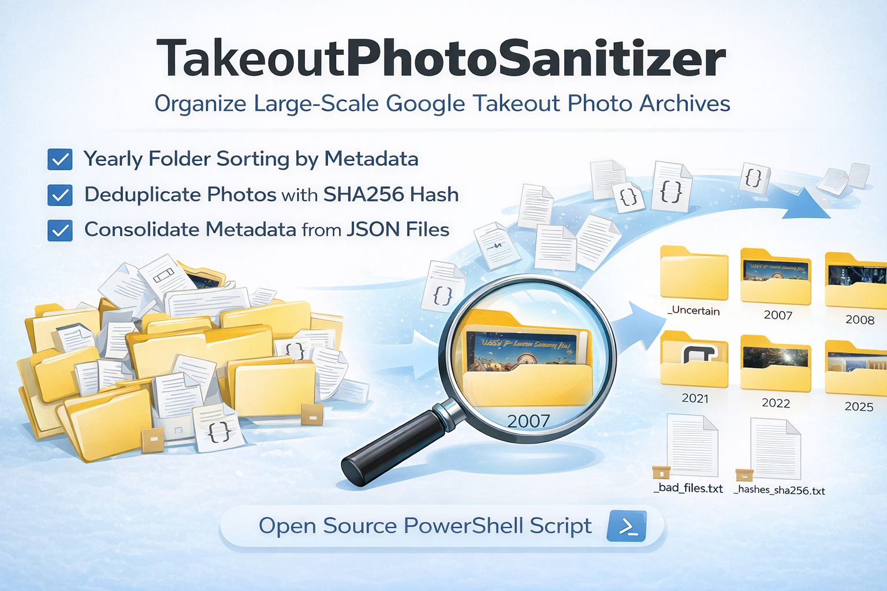

# TakeoutPhotoSanitizer

Version 1.0.0\
Last Updated: 2026-02-22

<p align="center">
  
</p>
------------------------------------------------------------------------

# 🇺🇸 English Description

## Why This Project Exists

When exporting Google Photos via Google Takeout, several structural
issues emerge:

-   Year contamination due to unreliable JSON creationTime
-   EXIF read failures causing massive fallback to `_Uncertain`
-   Hash representative (HashRep) propagation errors
-   Misinterpretation of 10-digit epoch timestamps (e.g., 2001
    classification)
-   Filename-based parsing issues, especially with Korean date formats

Most public tools focus only on EXIF-based sorting and do not address
metadata trust hierarchy, contamination protection, or reproducible
batch normalization.

TakeoutPhotoSanitizer was designed to:

-   Classify media by trust hierarchy:\
    JSON(photoTakenTime) → EXIF → filename → auxiliary metadata
-   Prevent current-year contamination (SuspectYear model)
-   Perform persistent SHA256 deduplication
-   Support safe large-scale ZIP batch processing
-   Operate as a metadata normalization engine

This is not merely a photo sorter, but a reliability-driven archival
normalization system.

------------------------------------------------------------------------

## Korean Metadata Handling

This project includes dedicated handling for Korean date expressions in
filenames:

-   Example: "2025년 3월 31일 오전 12_06_52"
-   Unicode-safe regex patterns (`\uXXXX`) to prevent encoding
    corruption
-   Designed for Windows Korean environments

The current release targets domestic (Korean) usage.

------------------------------------------------------------------------

## AI-Assisted Development

This project was iteratively developed with assistance from ChatGPT
(OpenAI).

AI assistance contributed to:

-   EXIF parsing improvements
-   Encoding-safe regex construction
-   Architecture refinement
-   Documentation clarity

All final architectural decisions and validation were performed by the
author.

------------------------------------------------------------------------

## Usage

### Requirements

-   Windows 10 / 11
-   Windows PowerShell 5.1 (recommended)\
    *(PowerShell 7.x also supported on Windows)*
-   Sufficient free disk space (recommended ≥ 25 GB)

You can check your PowerShell version:

``` powershell
$PSVersionTable.PSVersion
```

PowerShell 5.1 example output:

    Major  Minor  Build  Revision
    -----  -----  -----  --------
    5      1      22621  2506

------------------------------------------------------------------------

### How to Run

1.  Open **Windows PowerShell 5.1**\
    (Press `Win + R` → type `powershell` → Enter)

2.  Navigate to the repository folder:

``` powershell
cd C:\Users\jeong\Projects\TakeoutPhotoSanitizer
```

3.  Allow script execution for the current session:

``` powershell
Set-ExecutionPolicy -Scope Process -ExecutionPolicy Bypass
```

4.  Run the sanitizer:

``` powershell
.\TakeoutPhotoSanitizer.ps1 `
  -ZipDir "C:\Users\jeong\Projects\TakeoutPhotoSanitizer\Takeout_Zip" `
  -DestRoot "C:\Users\jeong\Projects\TakeoutPhotoSanitizer\Photos_Backup\From_Google_Takeout" `
  -BatchSize 2 `
  -MinFreeGB 25 `
  -ReportSidecars
```

------------------------------------------------------------------------

### Parameters

  Parameter           Description
  ------------------- ------------------------------------------------
  `-ZipDir`           Folder containing Google Takeout ZIP files
  `-DestRoot`         Destination root folder for normalized archive
  `-BatchSize`        Number of ZIP files processed per batch (default: 4)
  `-MinFreeGB`        Minimum required free disk space
  `-ReportSidecars`   Optional reporting of JSON sidecars

------------------------------------------------------------------------

### Notes

-   7-Zip must be installed, and `7z.exe` must be present in the system PATH for this script to function properly.
- `-ZipDir` and `-DestRoot` must be created in advance.
-   All ZIP files generated by Google Takeout should be placed inside `-ZipDir` before running the script.
-   `_work` folders are temporary and removed automatically.
-   ZIP files are moved to `_processed` (or deleted if configured).
-   `_Uncertain` contains files that could not be confidently
    classified.

------------------------------------------------------------------------


------------------------------------------------------------------------

# 🇰🇷 한국어 설명

## 왜 이 프로젝트가 필요한가

Google Takeout을 통해 Google 포토 데이터를 일괄 다운로드하면 다음과 같은
문제가 발생합니다:

-   JSON creationTime 오염으로 인해 잘못된 연도(예: 2026)로 분류
-   EXIF를 제대로 읽지 못해 대량의 파일이 `_Uncertain`으로 이동
-   해시 기반 중복 제거 과정에서 대표 경로(HashRep) 전염 문제
-   파일명 기반 epoch(10자리) 오해로 2001년 등으로 잘못 분류
-   한글 날짜 파일명 파싱 시 인코딩 문제 발생

기존 공개 도구들은 단순 정리 또는 EXIF 기반 재정렬에 집중하며, JSON
오염, 신뢰도 우선순위 설계, 현재 연도 보호(SuspectYear) 개념까지
고려하지 않습니다.

본 프로젝트는 다음 목표로 설계되었습니다:

-   JSON(photoTakenTime) → EXIF → 파일명 → (보조 정보) 순의 신뢰도 기반
    분류
-   현재 연도 오염 방지 설계
-   SHA256 기반 영속적 deduplication
-   대량 ZIP 배치 처리 안정성 확보
-   메타데이터 정규화 엔진으로서의 재현 가능 구조

이 프로젝트는 단순 정리 스크립트가 아니라, "메타데이터 신뢰도 기반 사진
정규화 엔진"입니다.

------------------------------------------------------------------------

## 한글 정보 처리

이 스크립트는 한국어 환경을 고려하여 설계되었습니다.

-   파일명 내 한글 날짜 패턴 처리
-   Unicode (`\uXXXX`) 기반 정규식으로 인코딩 안정성 확보
-   PowerShell 5.1 환경에서 한글 깨짐 방지

현재 버전은 국내 사용을 전제로 설계되었으며, Windows 한국어 환경에서
안정적으로 동작합니다.

------------------------------------------------------------------------

## 개발 방식 및 AI 활용

본 프로젝트는 OpenAI의 ChatGPT의 도움을 받아 개발되었습니다. 최종 설계 판단과 검증은 작성자가 직접 수행하였습니다.

-   EXIF 판독 문제 분석 및 개선
-   FromStream → FromFile 전환
-   정규식 인코딩 안정화
-   PowerShell 5.1 제약 대응
-   설계 문서화

본 소프트웨어는 어떠한 보증 없이 “있는 그대로(as-is)” 제공되며, 사용으로 인해 발생하는 모든 결과에 대한 책임은 전적으로 사용자에게 있습니다.
작성자는 본 소프트웨어의 사용으로 인해 발생하는 직접적·간접적·부수적 손해에 대해 어떠한 법적 책임도 지지 않습니다.

------------------------------------------------------------------------

## License

MIT License.

------------------------------------------------------------------------
