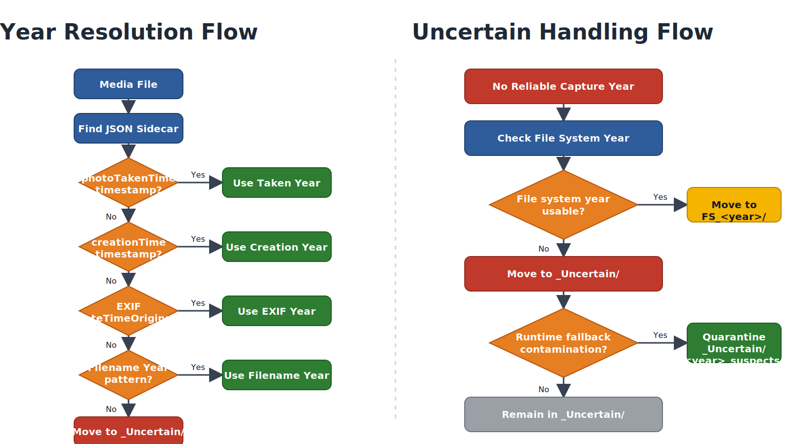

# Metadata Resolution and \_Uncertain Classification Strategy

This document explains how TakeoutPhotoSanitizer resolves multiple JSON
sidecars, determines media year classification, and handles files that
fall into uncertainty categories.

------------------------------------------------------------------------

## 1. How Metadata Is Recovered When Multiple JSON Files Exist

Google Takeout often produces inconsistent sidecar metadata:

-   A single media file may have multiple JSON files
-   JSON filenames may not exactly match the media filename
-   `.supplemental-metadata.json` and plain `.json` may coexist
-   Duplicate media (same SHA-256) may appear across different albums

The script follows a priority-based recovery strategy rather than full
JSON merging.

### 1.1 JSON Discovery Order

For each media file, candidate JSON sidecars are searched in this order:

1.  `<media>.supplemental-metadata.json`
2.  `<media>.json`
3.  `<mediaBaseName>.supplemental-metadata.json`
4.  `<mediaBaseName>.json`
5.  Title-based fallback matching

Filename normalization includes:

-   Unicode normalization (Form C)
-   Removal of duplicate suffixes like `__1`, `__2`
-   Case-insensitive comparison

------------------------------------------------------------------------

### 1.2 Folder-Level JSON Caching

The script scans JSON files once per folder and builds maps using:

-   `photoTakenTime.timestamp` (primary source)
-   `creationTime.timestamp` (secondary source)

Duplicate handling uses a metadata scoring model to retain the
highest-quality JSON.

------------------------------------------------------------------------

## 2. Year Resolution Priority

Year classification follows strict priority:

1.  JSON `photoTakenTime.timestamp`
2.  JSON `creationTime.timestamp`
3.  EXIF DateTimeOriginal
4.  Filename pattern parsing
5.  Unix epoch interpretation

If all methods fail, the file is treated as unresolved.

------------------------------------------------------------------------

## 3. `_Uncertain` Folder

### Definition

The `_Uncertain` folder contains media files for which no reliable
capture year could be determined using the defined resolution priority.

### Causes

-   Missing JSON
-   Corrupted EXIF
-   Invalid timestamps
-   Generated or edited images
-   Metadata stripped by external tools

Files in `_Uncertain` are explicitly marked as unresolved and require
manual review.

This is a metadata absence condition.

------------------------------------------------------------------------

## 4. `_Uncertain/<year>_suspects` Folder

This folder contains files that were temporarily assigned to the current
runtime year via fallback logic, but are considered suspicious.

These files:

-   May have been influenced by file system timestamps
-   May reflect ZIP extraction time
-   May contain ambiguous epoch values

Instead of silently placing them into a normal year folder, they are
isolated inside:

    _Uncertain/<currentYear>_suspects/

This is a runtime contamination safeguard.

It is different from `_Uncertain` because these files *do* have a
derived year, but the derivation is considered unreliable.

------------------------------------------------------------------------

## 5. `FS_<year>` (Fallback Sorted) Folders

### Definition

`FS_<year>` folders (e.g., `FS_2024`, `FS_2025`) contain files assigned
to a year based solely on file system timestamps when no stronger
metadata was available.

Typical sources:

-   `LastWriteTime.Year`
-   `CreationTime.Year`
-   Extraction timestamps

### Important Distinction

Unlike `_Uncertain`, files in `FS_<year>` do have a derived year.

Unlike `<year>/`, the year is heuristic and low-confidence.

This is a fallback-based classification.

------------------------------------------------------------------------

## 6. Confidence Hierarchy

  ---------------------------------------------------------------------------------
  Folder Type                     Confidence Level                Meaning
  ------------------------------- ------------------------------- -----------------
  `<year>/`                       High                            Verified capture
                                                                  year

  `FS_<year>/`                    Medium-Low                      File
                                                                  system--derived
                                                                  year

  `_Uncertain/`                   None                            No usable year
                                                                  metadata

  `_Uncertain/<year>_suspects/`   Contaminated                    Runtime fallback
                                                                  year, flagged
  ---------------------------------------------------------------------------------

------------------------------------------------------------------------

## 7. Archival Principle

TakeoutPhotoSanitizer separates identity from interpretation:

-   File bytes are immutable.
-   SHA-256 defines identity.
-   Year classification is metadata.
-   Metadata confidence must remain explicit.

Uncertainty is surfaced --- not hidden.
